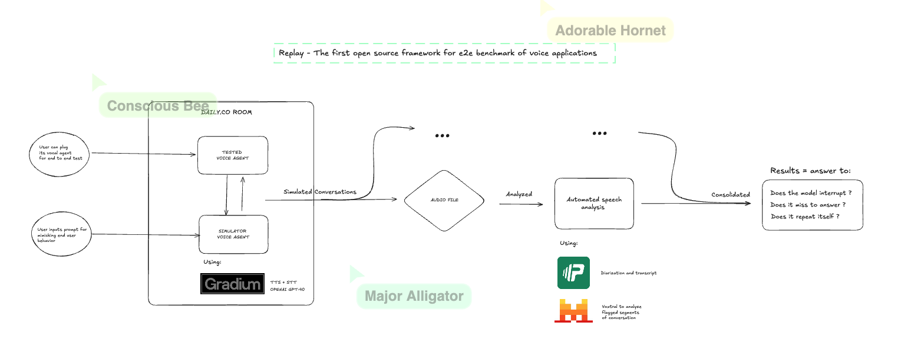

# Replay - The first open source framework for e2e benchmark of voice applications

An open source simulator-driven evaluation setup for end-to-end testing of voice-to-voice applications.

Currently, there are no good setups available to test voice-to-voice apps comprehensively, especially for latency, interruption handling, and other production critical aspects. This project fills that gap by enabling you to test any agent against another agent at scale for production use.

## Simulator

End-to-end voice evaluation simulator for testing agents in conversation. Deploy both a simulator agent and your tested agent to Pipecat Cloud, then use `run_conversation.py` to put them in the same Daily room for conversation testing.

**Quick start:**

1. Deploy simulator and tested agents to Pipecat Cloud (see `simulator/README.md` for details)
2. Configure environment variables in `simulator/.env`
3. Run the conversation:

```bash
cd simulator
python run_conversation.py
```

See [`simulator/README.md`](simulator/README.md) for detailed setup and deployment instructions.

script:
```bash
python final_submission/main.py audio/convo.wav --output results.json
```

gradio demo:
```bash
```




## Diarization

Scripts for speaker diarization using pyannote.ai.

**Upload a local audio file:**

```bash
uv run diarization/upload.py path/to/audio.wav
```

**Diarize an audio file (public URL or uploaded media):**

```bash
uv run diarization/diarize.py 'media://your-object-key'
# or with a public URL
uv run diarization/diarize.py 'https://example.com/audio.wav'
```

## Contributing

To avoid merge conflicts, **each contributor should push work in their own folder**.
